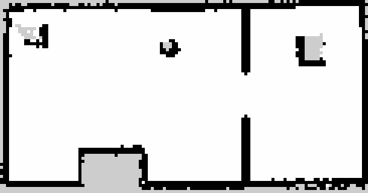

# SmallDog — ROS 2 + MuJoCo

12-DOF quadruped simulation for the printed ST3215 dog designed in [`../3d`](../3d):
description → ros2_control → gait node, with MuJoCo standing in for the hardware.


## Packages

| Package | Type | Purpose |
|---|---|---|
| `smalldog_description` | ament_cmake | URDF, link meshes, MuJoCo model — **all generated from the CAD** |
| `smalldog_ros_control` | ament_cmake | ros2_control wiring + MuJoCo launch |
| `smalldog_walker` | ament_python | trot gait + analytic leg IK, `/cmd_vel` → joint trajectory |
| `smalldog_teleop` | ament_python | keyboard teleop |
| `smalldog_hardware` | ament_python | **the real robot**: `robot/runtime`'s servo loop behind the walker's topics, and the L2 as a topic — "On the robot" below |
| `smalldog_nav` | ament_python | SLAM + Nav2 + the frontier explorer: the robot maps a room by itself — "SLAM and navigation" below |
| `tools/` | — | standalone MuJoCo sim, no ROS needed |

One external source dependency: **`mujoco_ros2_control`**, a fork on its `kilted` branch,
vendored as a submodule at `src/mujoco_ros2_control`. The LiDAR publisher, the camera
checks and the real-time pacing live there, so a pull that touches them needs one
`colcon build --packages-select mujoco_ros2_control`.

## Build & run

The workspace has its own ROS 2 environment in `pixi/` (macOS arm64 only, as committed).

```bash
pixi install --manifest-path ros2/pixi/pixi.toml    # ~2.3 GB, once
git submodule update --init                        # src/mujoco_ros2_control
source tools/env.sh
colcon build --symlink-install
```

Four pins in `pixi/pixi.toml` are load-bearing: `ros2_control 5.6` / `ros2_controllers 5.7`
(by hardware_interface 5.12 the fork's `MujocoSystemInterface` matches no `import_component`
overload); `libmujoco 3.3` (`mjv_moveCamera` grew an argument after); `clang_osx-arm64` by
name (without the conda wrapper's `-dead_strip_dylibs` the node links 18 rosidl dylibs it
never calls and dies at startup on `_PyExc_RuntimeError`); and `filelock`, which the
controller spawner imports.

One controller parameter is load-bearing too: `interpolate_from_desired_state: true` on
the trajectory controller (`config/smalldog-controllers.yaml`). ros2_controllers 5.7
renamed `open_loop_control` to it and dropped the old key without a word, and with it off
every streamed point restarts the interpolation from where the lagging servo actually is:
the trot reached the joints at ~40 % of its amplitude, and a 0.5 rad/s turn came out at
0.026 rad/s against 0.30 in the standalone sim (0.27 with the key). The walker also
clocks the gait on measured elapsed time now, not the timer's nominal period — a loaded
mac fires its 100 Hz timer at 65.

### Run

One terminal. Keys are read by the **MuJoCo render window** — the sim node republishes
every printable key on `~/key`, and the teleop node turns them into `/cmd_vel`. Click the
window and type.

```bash
./tools/sim.sh                 # flat ground, real time
./tools/sim.sh terrain:=true   # the heightfield scene
./tools/sim.sh teleop:=false   # no teleop node — drive it from a second terminal
./tools/sim.sh foxglove:=true  # plus a Foxglove websocket on ws://localhost:8765
./tools/sim.sh rtf:=2.0        # twice real time; rtf:=0 is unpaced (long unattended runs)
```

`sim.sh` kills stray `robot_state_publisher` processes first: a leftover keeps the next
`controller_manager` from coming up (`waiting for service /controller_manager/list_controllers`
forever). `tools/teleop.sh` is the second-terminal path for a headless or remote run; launch
with `teleop:=false` when you use it, or two teleop nodes fight over `/cmd_vel`.

```bash
pkill -f "ros2 launch smalldog"; pkill -f robot_state_publisher    # stopping
```

`tools/env.sh` picks `local_setup.zsh` or `.bash` to match the shell: sourcing the `.bash`
file from zsh silently never applies the overlay (`$BASH_SOURCE` is unset), and
`ros2 run smalldog_teleop keyboard` then says "package not found".

By hand:

```bash
eval "$(pixi shell-hook --manifest-path pixi/pixi.toml)"
source install/local_setup.bash
ros2 launch smalldog_ros_control smalldog-mujoco.launch.py
ros2 run smalldog_teleop keyboard                            # second terminal
```

### Checking it is alive

```bash
ros2 control list_controllers        # both must say "active"
ros2 node list | grep smalldog       # walker, controller, keyboard_teleop
ros2 topic info /cmd_vel             # 1 publisher (teleop), 1 subscriber (walker)
ros2 topic echo /mujoco_ros2_control_node/key   # what the render window is seeing
```

If the legs do not move: the teleop prints the `vx / vy / wz` it sends on every key. Silent
key topic → the MuJoCo window has no focus. Keys but no `/cmd_vel` → the teleop node is not
up. `/cmd_vel` with **2 publishers** → a leftover teleop still holding a command.

## Keyboard

```
  w / s      walk forward / back
  a / d      strafe left / right
  q / e      turn left / right
  space      stop
  r / f      body up / down          (0.09 … 0.20 m)
  , / .      speed  -  / +           (0.05 … 0.45 m/s)
  t          gait enable / disable
```

Published: `/cmd_vel` (Twist), `/smalldog/body_height` (Float64), `/smalldog/enable` (Bool).
Subscribed: `/mujoco_ros2_control_node/key` (String, one character per press). Backspace
belongs to the viewer and resets the sim. `read_stdin:=false` turns the raw-TTY reader off;
the node does that by itself whenever stdin is not a TTY.

## Without ROS 2

The gait and IK have no ROS imports, so everything runs from a bare env with `mujoco` and
`numpy`:

```bash
./tools/view.sh                             # interactive viewer, same key bindings
./tools/view.sh --terrain --lidar           # rough ground, with the LiDAR cloud drawn
python tools/standalone_sim.py --headless   # self-test: stand, trot, turn
python tools/standalone_sim.py --terrain    # either mode, on the rough-ground scene
python tools/standalone_sim.py --course     # 25 s over the ramp/wall/log obstacle course
python tools/standalone_sim.py --lidar      # ... with the L2 scanning (needs ../3d beside)
```

The interactive viewer goes through `tools/view.sh`: on macOS the passive viewer needs
`mjpython`, which cannot dlopen the uv venv's interpreter, and the wrapper sets
`DYLD_FALLBACK_LIBRARY_PATH` from `sysconfig`.

**Both viewers are paced to real time** (measured 1.000× off `/clock`; `rtf:=` on the ROS
launch, `CATCHUP` in `interactive()`). Unpaced they ran 1.5–3× real time, which is exactly
the kind of thing you calibrate your eye against. A machine that cannot keep up degrades
to slow motion rather than sprinting through a backlog. The headless runs are deliberately
not paced. Rendering is ~70 % of a frame and physics plus the whole ros2_control stack 7 %;
nothing there is worth optimising.

Current self-test:

```
model ok: 18 dof, 12 actuators, mass 2.493 kg
  stand    z= 170.6 mm  roll= +0.0 pitch= +0.1
  hold 1s  z= 170.5 mm  roll= +0.0 pitch= +0.0  drift= 21.0 mm
  trot 5s  z= 169.9 mm  roll= +2.8 pitch= -1.1  travelled x= 457.9 mm  y= -10.6 mm
  turn 4s  z= 152.9 mm  roll= +1.5 pitch= +1.4
RESULT: OK — stands and trots forward
```

`settle()` seeds the gait's rate limiter from the stance (it used to take one command at
`dt = 0`, which the limiter turned into 3e-4 rad, so the robot "settled" with straight legs
and every trot started from a ramp). The flat trot is deterministic to 0.1 mm and is the
control for any change; the terrain and course arms are read over seeds. `3d/CLAUDE.md`
carries the current baseline and how to read it.

## Rough ground

`mujoco/scene_terrain.xml` is the same world with the plane swapped for a heightfield —
`meshes/terrain.png`, generated by `../3d/terrain.py` and rewritten by `generate_model.py`.
Seeded fractal noise, ±27 mm over 160 mm (36° peak slope), flat inside 160 mm of the origin.
Same seed, same ground.

```bash
python tools/standalone_sim.py --headless --terrain            # default seed
python tools/standalone_sim.py --headless --terrain --blind    # feedback off
```

**One seed is not a measurement.** At fixed settings the trot spreads ±70 mm across seeds
and one seed moves ±100 mm under mass changes far too small to be a geometry regression.
Sweep seeds 7…12, one png per seed — MuJoCo caches a heightfield by file name inside a
process, so rewriting `terrain.png` and reloading silently reuses the first field compiled.
A dead-flat heightfield already costs the blind gait ~15 % against `type="plane"` (that is
the hfield contact, not the relief), so raising the amplitude is not the knob it looks like.

Terrain feedback against `--blind`, twelve seeds: better on 10 of 12; the blind trot rolls
over on two seeds and the closed loop never exceeds 13° of tilt. It costs ~4 % on the flat.

### The obstacle course

The heightfield alone is smooth — a foot always lands on a hillside. The scene also
carries ramps, walls and logs (`COURSE` in `../3d/terrain.py`) along +x, graded to what the
trot can clear (measured one obstacle at a time: ramps to 14°, walls to ~18 mm, logs to
~22 mm — the wall cliff between 18 and 22 mm is the 22 mm foot swing exactly). It starts at
x = 0.95 m, past what the 5 s regression trot reaches, so `--headless --terrain` measures
the relief and nothing else. `--course` walks it:

```
course: log at 950, ramp_up at 1583, deck at 1875, ramp_dn at 2166, wall at 2600, ...
  cleared 2/7: log ramp_up
  furthest x while inside the course corridor: 1791 mm
RESULT: upright ...
```

An obstacle is credited only when the robot passed it while still inside the 0.80 m
corridor — scoring on x alone credits walking around things. It is a *report*, not a
pass/fail: the unchanged model reads 5/7, 4/7 and 3/7 across sessions on one seed, and
seed 7 sits on a knife edge at the first obstacle. Read it over seeds 7 / 8 / 9.

An obstacle's rotation is a **quaternion**: `robot.xml` compiles with `angle="radian"`, so
a degree value is read as radians without a word. Ray-cast the *compiled* scene to check.
`generate_model.py --no-terrain-obstacles` leaves the course out;
`--terrain-amp/--terrain-wave/--terrain-seed` regenerate the field (restart the sim — it
keeps the heightfield it loaded).

### Terrain feedback

`smalldog_walker/gait.py` closes three loops on top of the open-loop profile, all fed by
`TrotGait.feedback(quat=..., gyro=..., contact=...)`:

- **body levelling** on the IMU: a body rotation lifts the foot corner at (x, y) by
  `roll·y − pitch·x` and the leg retracts by the same amount. Acts on the attitude
  low-passed over 0.30 s — most of what the IMU sees is the trot's own rocking, and chasing
  that costs half the forward speed.
- **stand where you land**: a debounced contact partway through the swing means the ground
  came up; the foot stops there instead of finishing a sine that would peel it off.
- **heading hold** on the IMU yaw. The command is in body axes, so a robot knocked off
  course curves through the world and the profile cannot notice. The reference is latched
  when it last started walking straight and dropped on a commanded turn.

Hold off → on over six terrain seeds: on the flat nothing changes; on the relief the final
|yaw| goes 9.4° → 3.9°; on the course 46.6° → 10.3°, path 2292 → 2836 mm, 1/6 → 0/6 down,
and the default seed goes from 1 obstacle cleared to 5. The loop corrects heading, not
position. **Sim yaw is truth; hardware yaw is an integrated gyro** (no magnetometer) — it
holds a line over a run, not an absolute bearing.

All three are optional and additive: with neither stream arriving, or either stale for
0.20 s, the gait is the blind gait. Under the ROS 2 launch the IMU arrives
(`imu_sensor_broadcaster`; the walker logs `IMU is live`); the foot contacts have no
publisher (Known gaps). Contact thresholds are keyed to the *measured* phase lag — the foot
leaves at s ≈ 0.6 and lands at ≈ 0.05, a tenth of a cycle behind the profile — and that lag
is the gait's own rate limiter, not the servo, so it wants re-measuring on hardware.

## LiDAR

The Unitree L2 is in the model as a **sensor**: `mujoco/robot.xml` carries a `lidar` site at
its optical centre and a `<custom>` block with the scan parameters, both written by
`../3d/lidar.py` out of the CAD.

```
/mujoco_ros2_control_node/lidar/points   sensor_msgs/PointCloud2, 12 Hz, SensorDataQoS
```

~5195 points a frame (measured 62340 /s at 12 Hz), float32 xyz in `lidar_link`, whose +Z is
the sensor's own axis, pointing forward (`LIDAR_TILT` 90). Simulated time stamps. About a quarter of the
rays return: the ground from ~280 mm ahead outwards, the course, and the robot's own legs
(the chassis it is bolted to is excluded; the legs are not, because a real sensor sees
them). The publisher is `src/mujoco_ros2_control/.../mujoco_lidar.{hpp,cpp}`; it uses
`mj_multiRay` with no GL context, runs at the sim cadence, and stays quiet on a model with no
`lidar` site. The scan *pattern* (measured, `3d/ref/lidar/`) exists twice — Python and C++ — because neither can
call the other; the parameters exist once, in the CAD. `smalldog_nav` is what subscribes
to the cloud.

**GPS**: mass and a frame only — 25 g on the mast, a `gps` site at the patch's phase centre
and a `gps_link` on TF (+Z the patch normal). No simulated fix; on hardware it is an NMEA
stream on a UART, not a ROS 2 sensor this workspace owns.

### Looking at it

```bash
./tools/view.sh --terrain --lidar              # MuJoCo's own viewer, cloud drawn into the scene
./tools/sim.sh terrain:=true foxglove:=true    # ROS 2 topic → ws://localhost:8765
```

The viewer draws the last six frames (0.6 s) in world coordinates, coloured by height,
subsampled to `CLOUD_MAX` = 6000 spheres. For the ROS 2 topic use **Foxglove, not RViz**
(`rviz2` is not in the pixi env and is not going in): *Open connection* → *Foxglove
WebSocket* → `ws://localhost:8765`, a 3D panel, the `…/lidar/points` topic, frame
`base_link`. The bridge advertises `/tf`, `/tf_static` and `/robot_description` with the
`assets` capability, so the URDF and its meshes load. It binds `127.0.0.1`; change `address`
in the launch file to watch from another machine. QoS matches the publisher's automatically.
The MuJoCo window the ROS launch opens does **not** show the cloud.

```bash
ros2 topic hz /mujoco_ros2_control_node/lidar/points
ros2 bag record -s mcap /mujoco_ros2_control_node/lidar/points /tf /tf_static /clock
```

Foxglove opens an `.mcap` directly, which is how to look at a run from another machine.

## SLAM and navigation

`smalldog_nav` maps a room with the L2 and walks it by itself. One command in the sim:

```bash
./tools/explore.sh                          # MuJoCo in the walled room + SLAM + Nav2 + explorer
./tools/explore.sh rtf:=2.0 save_map:=/tmp/room
```

Watch it on Foxglove (`ws://localhost:8765`, a 3D panel, frame `map`): `/map`, `/scan`,
`/global_costmap/costmap`, `/plan`. The MuJoCo window shows the robot; keys typed over it
do nothing here (`teleop:=false`, Nav2 owns `/cmd_vel`).



What one run reads (2026-09-15, real time, the mac in a video call beside it): a 25 s spin
on the spot, then ten goals in 4.5 min, one blacklisted, and `explored: no frontier left.
17.8 m2 known, 15.2 m2 free` — the two rooms are 18 m² of floor. The map above is that
run's `save_map` output: both rooms, the doorway, the pillar, the couch and both crates,
walls one cell thick. Most goals end as "is mapped, moving on" rather than "reached": a
frontier is the edge of what the L2 has seen, and on a 6 m sensor in a 6 m world the edge
moves before the robot gets there — that is the exploration working, not failing.

The chain, each step one node:

| step | node | in → out |
|---|---|---|
| odometry | `smalldog_walker` (in the walker, `odom:=true` default) | gait velocity + IMU yaw → `/odom`, TF `odom → base_footprint → base_link` |
| cloud → scan | `smalldog_nav cloud_to_scan` | the L2 cloud → `/scan`, a 0.10..0.35 m slice in the level frame, ±96° |
| SLAM | `slam_toolbox` (async, mapping) | `/scan` + `odom` → `/map`, TF `map → odom` |
| navigation | Nav2: planner (NavFn), controller (regulated pure pursuit), behaviors, BT | `/map`, `/scan`, a goal → `/cmd_vel` |
| exploration | `smalldog_nav explore` | `/map` → `navigate_to_pose` goals until no frontier is left |

`nav.launch.py` is the chain without the sim, for either machine:

```bash
ros2 launch smalldog_nav nav.launch.py explore:=true                 # sim (sim.sh teleop:=false first)
ros2 launch smalldog_nav nav.launch.py use_sim_time:=false cloud:=/lidar/points speed:=0.08 explore:=true
                                                                     # robot (robot.launch.py imu:=true lidar:=true)
ros2 topic pub -1 /smalldog/explore std_msgs/msg/Bool "{data: false}"   # pause; true resumes
```

**Odometry** is dead reckoning: the walker integrates the velocity its stance feet are
sweeping (the command after the heading hold and the stride clamps, `TrotGait.body_velocity()`)
times `odom_scale`, and takes heading from the IMU (truth in the sim, an integrated gyro on the
robot). `odom_scale` is the foot slip: the sim trot delivers ~0.5 of its command on the flat
(measured against `qpos` over 6 s: 0.53 at 0.15 m/s, 0.49 at 0.10, 0.67 at period 1.35), so
the sim launch sets 0.5; the robot's is unmeasured (**verify** — walk a taped 2 m and compare
`/odom`). slam_toolbox's scan matcher absorbs the rest; a scan node every 0.1 m keeps its
0.5 m search window honest. `base_footprint` is the level frame: base_link lifted by the
standing height and tilted back by the IMU's roll and pitch, so the scan slice keeps the
floor out while the trot rocks the body ±3°.

**The scan** is ±96° — the L2's cone about its forward axis — and no wider: behind the
robot is unknown, not clear (an empty bin is `inf`, dropped by both consumers), which is
why the explorer spins once before choosing a goal. `cloud_to_scan` is this package's own
sixty lines rather than `pointcloud_to_laserscan`: that node's TF message filter held every
cloud and dropped it ten seconds later under this Kilted env while `can_transform` said yes
throughout (the header of `cloud_to_scan.py` has the details).

**The explorer** takes free cells with an unknown neighbour, clusters them, and walks to
the cluster that scores best on distance minus half its length — a long edge across the
room beats a fragment beside the robot. A goal is a cluster cell with no obstacle within
0.28 m, so the planner never has to reject one; a goal that stops being a frontier is
dropped, not walked out; a goal Nav2 fails is blacklisted (0.4 m). No frontier three checks
running → done: it prints the known and free area, saves the map (`save_map:=stem` →
`stem.pgm` + `.yaml` through `/slam_toolbox/save_map`) and walks back to the origin.

**Nav2's numbers that are this robot's** (`config/nav2.yaml`): `robot_radius` 0.18, inflation
0.35, no reversing, rotate-to-heading on, 0.5 rad/s turns (the gait's own clamp), no lateral
commands, `Twist` not `TwistStamped` (`enable_stamped_cmd_vel: false`, the walker reads
`Twist`). The straight-line speed is the launch's `speed` (0.15 in the sim; 0.08 on the
robot with the heading hold, robot.launch.py). slam_toolbox is a lifecycle node in Kilted
and comes up unconfigured — its own `lifecycle_manager_slam` brings it up, before Nav2's
manager, whose planner waits for the `map` frame at activation.

Two things bit on the way in and are worth knowing: the pixi env for this came in with a
truncated `libspqr.4.dylib` (a dropped download; slam_toolbox died at configure with
"mutex lock failed") — sizes against `conda-meta/*.json` find such a file, delete it and its
rattler cache dir and `pixi install` again; and the IMU spawner's default 10 s service
timeout gave up under this launch's load, so the sim launch now passes
`--service-call-timeout 30`.

The room, `mujoco/scene_room.xml` (`room:=true` on the sim launch; `ROOM` in
`generate_model.py`): 4 × 3 m with the robot at the centre facing +x, a 0.8 m doorway into
a 2 × 3 m second room, a pillar, a couch and two crates, walls 0.5 m tall.

### The other frontend, and why nothing is built on it

`robot/slam/slam.py` is a second, unrelated answer to the same problem: KISS-ICP on the
full 3-D cloud instead of slam_toolbox on a 2-D slice, with no odometry input at all.
`tools/walk_map.py` measures it, in this same room:

```bash
python tools/walk_map.py --selftest      # the harness, 4 s
python tools/walk_map.py --path patrol   # both rooms and the doorway, scored against truth
python tools/walk_map.py --path still    # the control arm
```

It trots the gait through `scene_room.xml`, casts the measured L2 pattern **with motion
distortion modelled** (`lidar.Scanner` casts a whole frame from its end pose; this casts
it in `--slice-ms` pieces as the robot moves, which is what a sweeping sensor really hands
you), feeds that odometry, and scores both the trajectory and the map against MuJoCo's own
truth. `--rigid` is the no-smear control, `--stack N` registers N frames at once. It keeps
no description of the room: the surfaces come out of the compiled model, so it scores
against the scene that was actually simulated and cannot drift from it.

**The 3-D frontend does not hold a pose** — 0.48 m of drift with the robot standing
perfectly still, replaying the real onboard capture, because one 83 ms L2 frame is 18
meridian sweeps rather than a sample of the surfaces. That is the measurement behind
`smalldog_nav` taking the 2-D-scan-plus-gait-odometry route, and the reason to keep taking
it. The numbers, the cause and what would change it are in
[`../robot/README.md`](../robot/README.md), "SLAM".

## Regenerating the model from CAD

```bash
../3d/.venv/bin/python smalldog_description/scripts/generate_model.py
```

Imports `../3d/mini_dog.py`, exports one STL per link in its own frame, integrates mass
properties from the tessellated solids at measured print density plus the payload point
masses, and writes `urdf/smalldog.urdf`, `mujoco/{robot,scene,scene_terrain,defaults}.xml`,
`meshes/terrain.png` and `robot_params.json`. **Every density, mass, limit and actuator
constant comes from `mini_dog.py`** — this script keeps no copies (it did, and the servo
mass, the joint limits and the `MJ_*` constants each drifted once). The workspace is built
`--symlink-install`, so regenerated files are picked up without a rebuild; a *new* file
needs one `colcon build --packages-select smalldog_description`.

`../3d/export_sim.py` is the other exporter of the same CAD (different link decomposition:
the foot is a separate part there). Both are re-run after a model change; `3d/CLAUDE.md`
step 6 is the checklist.

`robot_params.json` is the single source the gait, the runtime and `rl/` read: link
lengths, hip offsets, the three limit ladders, the rate ceiling, the nominal stance.

## Model facts

| | |
|---|---|
| total mass | 2.493 kg (base 1.559 kg incl. battery, Orange Pi, LiDAR, GPS, camera, IMU) |
| leg reach | 98…152 mm from the hip-pitch axis → usable body height 150…170 mm |
| joints | `{fl,fr,rl,rr}_{roll,pitch,knee}` — 12 servo IDs 1…12 in that order |
| joint limits | roll ±1.5708, pitch ±1.5708, knee ±1.9199 rad — **read** from the CAD ROM scan (`3d/out/bom.json`) via `export_sim.joint_rom()`, so the two exporters cannot drift |
| MuJoCo hard stops | 0.03 rad **inside** the URDF limits, so the measured position can never trip ros2_control's joint limiter |
| gait soft limits | 0.12 rad inside the mechanical limits → roll/pitch 1.4508, knee 1.7999 |
| joint effort / velocity | 3.2 N·m, the torque rig's full-duty peak (PLAN.md 3d; the held 2.3 is a runtime budget); 3.28 rad/s achievable ceiling `(forcerange − frictionloss)/damping`, below the measured 3.86 no-load; the generator takes `min()` |
| nominal stance | base 181 mm above ground, gait default 158 mm |
| meshes | 13 link meshes + 12 ST3215 bodies (visual only — their mass is in each link's `<inertial>`) |
| links | `base_link` + `{leg}_hip` / `{leg}_thigh` / `{leg}_shin` (foot fused into shin), plus fixed `imu_link`, `lidar_link`, `gps_link` |

`robot_params.json` keeps **one magnitude per kind** in `joint_limits_rad` and
`joint_soft_limits_rad`, because every consumer reads it that way; the signed per-leg pairs
are in `joint_limits_rad_signed`, and the generator asserts the scan is symmetric before
writing them. ±90° of roll and pitch is where the ROM *scan window* stopped, not where the
leg fouls; widening the scan in `3d/mini_dog.py` is the way to find out. The soft limits
also clamp the real servos (`robot/runtime/calib.py`).

Collision model: boxes/capsules for the links, a sphere per foot with its own friction and
`priority="1"`, `condim="4"` (`3d/CLAUDE.md` has why). Self-collision is off — joint limits
already come from the CAD sweep. `sum(model.body_mass)` matches `robot_params.json` exactly.

## Gait

`smalldog_walker/gait.py` — trot, diagonal pairs `(FL,RR)` / `(FR,RL)`, duty 0.5.

- `period` 0.45 s, `swing_height` 22 mm, `max_step` ±60 mm fore/aft, ±30 mm lateral
- **the leg is short**: 75 + 82 mm gives ~50 mm of vertical foot travel, so `body_height`
  is clamped to the band where stance and swing apex both stay in reach; asking for more
  shrinks the swing instead of producing an unreachable target
- yaw folds in as `v + ω × r_hip`; a `_moving` blend keeps the feet planted when the command
  drops to zero
- joint outputs are clamped to the soft limits, then rate-limited against
  `joint_rate_ceiling_rad_s` = 3.28 from `robot_params.json` (the achievable joint speed
  under load; it used to limit against the vendor no-load speed and 32 % of commanded
  samples asked for a speed the joint does not have)

`leg_kinematics.py` is closed-form: the roll angle comes from the requirement that the foot
lands in the thigh/shin plane, then a 2-link solve in that plane. FK/IK round-trip to 1e-6:

```bash
PYTEST_DISABLE_PLUGIN_AUTOLOAD=1 python -m pytest smalldog_walker/test -q   # 11 passed
```

(the prefix is not optional in this pixi env — `launch_testing` registers a pytest hook
against an older pluggy and pytest refuses to start).

### Forward speed, and what does not move it

The trot achieves ~75 % of the commanded speed. Four hypotheses were measured and are dead:
not torque (force inside ±3 N·m 99 % of every run), not actuator stiffness (`kp` 25 → 200
cuts tracking error 3× and moves the distance not at all), not the swing profile (a C1
profile that halves peak knee demand is a regression), not rate-limit clipping (a period
long enough to satisfy the limiter is inside one seed-sweep's noise). What explains it:
**the body advances mostly by the foot moving over the ground, not by the stance sweeping**
— stretch the period and the loaded stroke falls while ground travel rises, and the sum is
unchanged. The operating point is a traction equilibrium set by the foot friction and the
sphere-on-heightfield contact, and tuning those would make the simulation faster without
making the robot faster. The answer is in the real foot on the real floor (PLAN.md step 5).

### The foot's contact patch, and why growing it changed nothing

The foot is one `sphere` geom, so one contact point at any attitude; the shin is 34.6° off
vertical while carrying load (46.7° worst), so the dome touches a third of the way round its
side and rolls ~25° during a stance. `tools/foot_contact.py` builds alternatives through
`MjSpec` (writing nothing) and runs each beside the unchanged control:

| arm | what it is | flat, mm | rough, mm (6 seeds) | pts/foot | skid |
|---|---|---|---|---|---|
| `base` | as shipped — **the control** | 781.1 | 625.6 ±94 | 1.00 | 28.7 |
| `grip` | same dome, torsion friction on | 785.5 | 572.1 ±222 | 1.00 | 32.5 |
| `pad` | dome truncated 3.5 mm to a ⌀17.7 flat, raked to the loaded shin | 773.6 | 531.8 ±176 | 1.37 | 25.1 |
| `tripod` | three ⌀10 lobes on a ⌀16 ring | 760.4 | 485.1 ±252 | 1.88 | 30.9 |
| `ankle` | flat pad on a passive sprung rocker | 445.8 | 404.7 ±117 | 1.33 | 199.9 |

(Measured before the fitted actuator, so the absolute distances are old; the comparison
holds.) A real patch buys nothing: flat within ±21 mm of the control, rough equal or worse
against the seed spread, the passive ankle unambiguously negative at every spring rate.
`--push` says why: lean 6 N on the standing robot and the body gives 5.6 mm whatever the
foot is — the compliance that matters is the servo's `kp`, and Coulomb friction does not
depend on area. MuJoCo contact is rigid; what a TPU dome does under 60 N (squash into a
patch) is not represented at any shape.

What *was* changed is the contact model in `3d/mini_dog.py` section 4 (`MJ_FOOT_*`, read by
both exporters): `condim` 3 → 4 so a planted foot resists twist (not 6 — rolling triples the
terrain spread), a torsion coefficient derived from the real patch (⅔·a·μ·f_n, a =
1.4…2.1 mm in 95A TPU), and `priority="1"` so the foot's numbers — `solref`/`solimp`
included — win over the floor's. Check a contact model by reading `d.contact[i].friction`.

Two harness facts before repeating any of this: **the heightfield cannot compare feet** —
at `CELL_MM` = 12 a ⌀17.7 face is smaller than one cell and collides with prism walls
(`tripod` stood still with 4 kN through its touch sensors); `--rough` (a plane strewn with
tilted slabs) is the arm that can. And the walker feeds on `<touch>` sites of r = 14 mm
around each ankle; a foot whose contacts land further out is a foot the walker cannot feel
(`SITE_R`, and the `site` control arm that proves the enlarged site is inert on its own).

## On the robot

The Orange Pi runs Ubuntu 24.04 with ROS 2 Jazzy from apt (`/opt/ros/jazzy`, no pixi, no
ros2_control). `smalldog_hardware/servo_node.py` is the hardware side: it wraps
`robot/runtime` — the bus driver, `calib.json`, the safety guard, the 50 Hz tick — and
subscribes to the same `/smalldog_controller/joint_trajectory` the walker streams to the
MuJoCo controller, so the walker does not know which one it is driving. It publishes
`/joint_states` (effort = Present Load) and, with `imu:=true`, `/imu` from the BMI088.
There is no ros2_control plugin on purpose: the runtime is the one copy of the servo
handling the bench can test, and a C++ hardware_interface would be a second.

```bash
cd ~/smalldog/ros2 && source /opt/ros/jazzy/setup.bash
colcon build --symlink-install --packages-select smalldog_description smalldog_walker smalldog_teleop smalldog_hardware
source install/setup.bash
ros2 launch smalldog_hardware robot.launch.py imu:=true joy:=true   # stand; drive it from the gamepad
ros2 launch smalldog_hardware robot.launch.py imu:=true lidar:=true  # + the L2 on /lidar/points, for smalldog_nav
ros2 run smalldog_teleop keyboard --ros-args -p speed:=0.08 -p turn:=0.65   # or a keyboard, second terminal
tools/robot_go.sh 5 0.08                                   # or: walk straight 5 s, hands off
```

`lidar:=true` is `smalldog_hardware/lidar_node.py`: `3d/tools/stream_pcd`'s TCP feed
(`robot/slam/slam.py`'s reader, imported) republished as `PointCloud2` in `lidar_link`,
the same shape the sim publishes, so `nav.launch.py` is the same launch over either. Needs
`stream_pcd` running on the Pi, and `ros-jazzy-slam-toolbox` plus the Nav2 servers
`nav.launch.py` starts from apt (`ros-jazzy-nav2-controller -planner -behaviors
-bt-navigator -lifecycle-manager -navfn-planner -regulated-pure-pursuit-controller`).
Untested on the robot (**verify**): the SDK's X about the axis against the CAD's
(`yaw_offset`), the odometry scale, and the scan slice against the real floor.

The gamepad (a 2.4 GHz "Barrot" pad the kernel drives as an Xbox 360 controller,
`/dev/input/js0`) goes through the `joy` package's `joy_node` and
`smalldog_teleop/joy_teleop.py`: left stick walks and strafes, right stick turns, D-pad
up/down is body height, B stops, Start toggles the gait, LB held is full speed (0.6 of
it otherwise). Let go of the stick and it stops; lose the pad and it stops within 0.5 s.
One stick at a time — forward plus a turn is over the servo's speed budget.

Ctrl-C sits the robot down and cuts torque (the node's own signal handler; the loop
leaves through `Runtime.__exit__`). The node refuses to enable torque when the trajectory
topic has two publishers — a leftover MuJoCo launch on the mac reaches the Pi over the
LAN on domain 0 and was the robot's first goal once. Give the robot its own
`ROS_DOMAIN_ID` if the mac is going to run the sim at the same time.

The launch file carries the gait fitted to the servo (`robot/README.md`, "The gait is
fitted to the servo"), not the sim's numbers: period 1.35 s, `stride_max` raised to
admit it, and the heading hold capped at `yaw_max` 0.2 rad/s. Measured on the floor,
2026-09-15, 2.5 kg, 10.7 V:

| | speed | tracking error, peak | |
|---|---|---|---|
| `imu:=false` (the blind trot, what `walk.py` runs) | 0.11 m/s | 31° | walks; the same 30° `walk.py` sees |
| `imu:=true`, the gait's own `yaw_max` 0.5 | 0.11 | 62° | **tripped** at 0.7 rad on a knee: 0.11 m/s already spends the whole 3.28 rad/s ceiling, and 0.5 rad/s of correction on top demands 4.65 |
| `imu:=true`, `yaw_max` 0.2 (the default) | 0.08 | 44° | walks, 5 s; demand 3.04 rad/s |

44° against a 40° trip held for 0.32 s is not margin. The blind trot veers ~7°/s on this
floor, which is what the hold is correcting, at a speed cost.

## Known gaps

- Foot contact is not published under ROS 2 (`/smalldog/foot_load` has no publisher), so the
  launched robot runs with levelling and heading hold but without the landing latch. On
  hardware there are no foot switches either — the topic is a *load*, so the knee servo's
  own load reading can drive it (`smalldog_walker/contact.py`; measured in
  `robot/README.md`).
- Odometry is dead reckoning off the gait (`odom_scale` unmeasured on the robot); the
  GPS is framed but not read. `lidar.Scanner` is not motion-compensated (every point of a
  frame is cast from the end-of-frame pose — 20 mm at 0.2 m/s); `tools/walk_map.py`
  compensates by casting in slices, and measures what the difference is worth.
- `3d/tools/stream_pcd.cpp` reads the L2's IMU and forwards only `linear_acceleration`:
  the sensor's **gyro is read and dropped on the wire**, and so is per-point `time`. Both
  are wanted by anything that deskews or propagates between frames.
- SLAM and navigation have run in the sim only; nothing under `smalldog_nav` has met the
  real L2 or the real floor.
- Keys reach the teleop only while the MuJoCo window has focus, on press only (GLFW
  auto-repeat dropped); non-printable keys are not forwarded.
- `pkill -f robot_state_publisher` before relaunching, or the next `controller_manager`
  never comes up.
