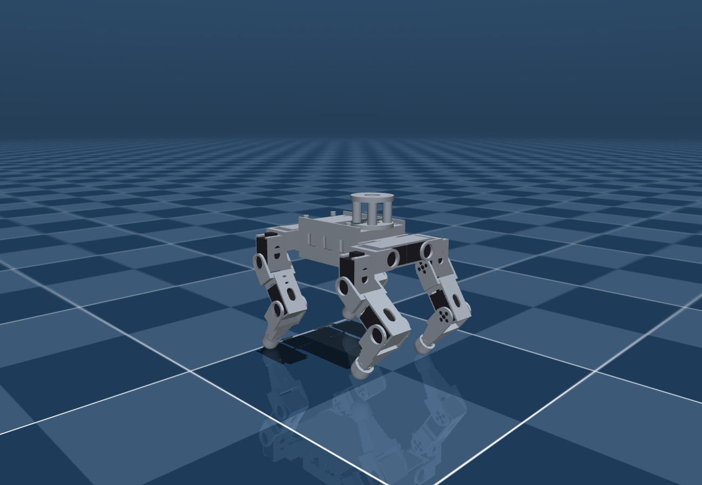

# SmallDog — ROS 2 + MuJoCo

12-DOF quadruped simulation for the printed ST3215 dog designed in [`../3d`](../3d).
Layout follows the hexapod project (`ogonek25-spider/ros2`): description → ros2_control →
gait node, with MuJoCo standing in for the hardware.



## Packages

| Package | Type | Purpose |
|---|---|---|
| `smalldog_description` | ament_cmake | URDF, link meshes, MuJoCo model — **all generated from the CAD** |
| `smalldog_ros_control` | ament_cmake | ros2_control wiring + MuJoCo launch |
| `smalldog_walker` | ament_python | trot gait + analytic leg IK, `/cmd_vel` → joint trajectory |
| `smalldog_teleop` | ament_python | keyboard teleop |
| `tools/` | — | standalone MuJoCo sim, no ROS needed |

One external source dependency: **`mujoco_ros2_control`**, the spider project's fork on
its `kilted` branch, vendored here as a submodule at `src/mujoco_ros2_control`.

## Build & run

This workspace has **its own ROS 2 environment**, in `pixi/`. It used to borrow the spider
project's, which meant smalldog could not run without an unrelated project checked out
beside it, and it shipped whatever controller set the spider happened to need —
`imu_sensor_broadcaster` was not among them, so the launched robot had no IMU topic and
the gait ran blind no matter what was wired up.

### Build once

```bash
pixi install --manifest-path ros2/pixi/pixi.toml    # ~2.3 GB, once
git submodule update --init                        # src/mujoco_ros2_control
source tools/env.sh
colcon build --symlink-install
```

Four pins in `pixi/pixi.toml` are load-bearing, and each is there because the workspace
does not build or does not start without it. `ros2_control 5.6` / `ros2_controllers 5.7`:
by hardware_interface 5.12 the fork's `MujocoSystemInterface` matches no `import_component`
overload. `libmujoco 3.3`: `mjv_moveCamera` grew an argument after that. `clang_osx-arm64`
by name: `c-compiler` 2.0 stopped pulling the conda wrappers on this platform, CMake then
silently takes `/usr/bin/c++`, and without the wrapper's `-dead_strip_dylibs` the node
links 18 `*__rosidl_generator_py` dylibs it never calls and dies at startup on
`symbol not found in flat namespace '_PyExc_RuntimeError'`. And `filelock`, which
`controller_manager`'s spawner imports — without it every controller fails to spawn.

### Run

One terminal. The keys are read by the **MuJoCo render window**: the sim node
republishes every printable key pressed over its viewer on `~/key`, and the teleop node —
launched here, with no TTY of its own — turns those into `/cmd_vel`. Click the MuJoCo
window and type.

```bash
./tools/sim.sh                 # flat ground
./tools/sim.sh terrain:=true   # ... or the heightfield scene
./tools/sim.sh teleop:=false   # ... or no teleop node, drive it from a second terminal
./tools/sim.sh foxglove:=true  # ... plus a Foxglove websocket on ws://localhost:8765
```

`sim.sh` kills stray `robot_state_publisher` processes first: leftovers from a previous
launch keep the next `controller_manager` from ever coming up, and the symptom is an
endless `waiting for service /controller_manager/list_controllers`.

`tools/teleop.sh` is the old second-terminal path, for when the viewer does not have the
keys — a headless run, or a remote one. It reads raw stdin, so it needs its own focused
TTY, and it waits for `/smalldog_walker` to appear before starting. Launch with
`teleop:=false` when you use it: two teleop nodes both publish `/cmd_vel` at 50 Hz and
fight over the robot.

On macOS you can open it in its own Terminal window from anywhere:

```bash
osascript -e 'tell application "Terminal" to do script "'$PWD'/tools/teleop.sh"'
```

### Stopping

```bash
pkill -f "ros2 launch smalldog"
pkill -f robot_state_publisher      # always, or the next launch hangs
```

`tools/env.sh` picks `local_setup.zsh` or `local_setup.bash` to match the running shell.
That matters: ROS 2's `local_setup.bash` finds its own directory through `$BASH_SOURCE`,
which zsh does not set, so sourcing the `.bash` file from zsh silently looks in `$PWD`
and the workspace overlay is never applied — `ros2 run smalldog_teleop keyboard` then
fails with "package not found" while `ros2` itself works fine.

### Doing it by hand

```bash
eval "$(pixi shell-hook --manifest-path pixi/pixi.toml)"
source install/local_setup.bash
ros2 launch smalldog_ros_control smalldog-mujoco.launch.py
ros2 run smalldog_teleop keyboard                            # second terminal
```

### Checking it is alive

```bash
ros2 control list_controllers        # both must say "active"
ros2 node list | grep smalldog       # walker, controller, keyboard_teleop
ros2 topic info /cmd_vel             # 1 publisher (teleop), 1 subscriber (walker)
ros2 topic echo /joint_states --once
ros2 topic echo /mujoco_ros2_control_node/key   # what the render window is seeing
```

If the legs do not move, check `/cmd_vel` first: the teleop prints the `vx / vy / wz` it
thinks it is sending on every key. If that is silent, check the key topic above — nothing
there means the MuJoCo window does not have focus (click it), and something there with a
silent `/cmd_vel` means the teleop node is not up. `/cmd_vel` with **2 publishers** is a
leftover teleop from an earlier run still holding a command.

## Keyboard

```
  w / s      walk forward / back
  a / d      strafe left / right
  q / e      turn left / right
  space      stop
  r / f      body up / down          (0.09 … 0.20 m)
  , / .      speed  -  / +           (0.05 … 0.45 m/s)
  t          gait enable / disable
```

Type them into the **MuJoCo window** (or into the teleop's own terminal, on the
`teleop:=false` path). Backspace still belongs to the viewer itself and resets the sim.

Published: `/cmd_vel` (Twist), `/smalldog/body_height` (Float64), `/smalldog/enable` (Bool).
Subscribed: `/mujoco_ros2_control_node/key` (String, one character per press) — the
`key_topic` parameter. `read_stdin:=false` turns the raw-TTY reader off; the node does that
by itself whenever stdin is not a TTY, which is what makes it launchable.

## Without ROS 2

The gait and IK have no ROS imports, so the whole thing runs from a bare Python env
with `mujoco` and `numpy`:

```bash
./tools/view.sh                             # interactive viewer, same key bindings
./tools/view.sh --terrain --lidar           # ... rough ground, with the LiDAR cloud drawn
python tools/standalone_sim.py --headless   # self-test: stand, trot, turn
python tools/standalone_sim.py --terrain    # either mode, on the rough-ground scene
python tools/standalone_sim.py --course     # 25 s over the ramp/wall/log obstacle course
python tools/standalone_sim.py --lidar      # ... with the L2 scanning
```

**The interactive viewer goes through `tools/view.sh`, not `python`.** On macOS the passive
viewer must run under `mjpython` (it needs the main thread), and `mjpython` then cannot
dlopen the uv-built venv's interpreter — it dies on `Library not loaded:
@rpath/libpython3.12.dylib` before the script runs. `view.sh` asks `sysconfig` where that
dylib actually is and sets `DYLD_FALLBACK_LIBRARY_PATH`. The headless runs have neither
problem and stay on plain `python`.

`--lidar` is the only flag that needs the CAD tree (`../3d`) beside the workspace — the
scan model lives in `../3d/lidar.py`, next to the geometry it is a sensor for.

**The viewer is paced against the wall clock, and that is not the obvious way round.** The
physics here runs 26–37x real time (measured, 1 ms steps, flat and heightfield), so an
unpaced `while v.is_running(): step; sync()` does not run fast — it runs at whatever rate
`sync()` allows, and `sync()` is a scene copy under a lock, an order of magnitude dearer
than the step it follows. Calling it once per 1 ms step is also ~16x more often than 60 fps
needs. The result was a robot in slow motion for no reason at all: 0.50x real time on the
flat scene, 0.48x on terrain, at ~500 sync/s. `interactive()` now steps to a wall-clock
budget and syncs at 60 Hz — 0.99x real time at 58 sync/s, on both scenes. `CATCHUP` caps how
much sim time one frame may make up, so a dragged window or a scene heavy enough to fall
behind degrades to slow motion instead of sprinting to catch up. None of this touches the
headless runs, which have no viewer and are deliberately not paced.

Current self-test result:

```
model ok: 19 dof, 12 actuators, mass 2.499 kg
  stand    z= 199.4 mm  roll= +0.0 pitch= +0.0
  hold 1s  z= 170.0 mm  roll= -0.0 pitch= -0.0  drift= 10.5 mm
  trot 5s  z= 167.7 mm  roll= +1.3 pitch= +0.5  travelled x= 780.1 mm  y=  -4.6 mm
  turn 4s  z= 168.7 mm  roll= -0.0 pitch= +0.1
RESULT: OK — stands and trots forward
```

0.15 m/s against a 0.20 m/s command, 5 mm lateral drift over 5 s, attitude within 1.4°.
That 22 % is not lag or torque — see "Forward speed, and what does not move it" under Gait
before trying to tune it out.

## Rough ground

`mujoco/scene_terrain.xml` is the same world with the ground plane swapped for a
heightfield — `meshes/terrain.png`, generated by `../3d/terrain.py` and rewritten by
`generate_model.py` on every run. Seeded fractal noise, ±27 mm over a 160 mm wavelength
(36° peak slope), flat only inside 160 mm of the origin (the stance footprint, so the robot
spawns level) and fully rough 250 mm further out. Same seed, same ground, so two runs are
comparable.

```
python tools/standalone_sim.py --headless --terrain
  stand    z= 186.4 mm  roll= +0.0 pitch= +0.0
  trot 5s  z= 172.5 mm  roll= +0.6 pitch= +3.5  travelled x= 675.1 mm  y=  -2.9 mm
  turn 4s  z= 164.8 mm  roll= -1.0 pitch= -3.5
RESULT: OK — stands and trots forward
```

675 mm against 780 mm on the flat — and **read that single number over a seed sweep, not on
its own**: at 2.495 kg it was 585 mm on this seed and 610 ±51 mm over seeds 7…12, and one
seed moves ±100 mm under mass changes far too small to be a geometry regression (0.1 g of
`gps_mount` moved the default seed 690 → 585 with the flat trot unmoved; swapping the
11.1 g LiDAR guard for the 16.1 g camera — +5 g net — moved it 585 → 675 with the flat
trot again unmoved, at 780). `--blind` runs the same thing with the terrain feedback
switched off, which is what this gait was until 2026-08-27; over twelve terrain seeds
(swept at the old 2.10 kg mass model — the numbers below have not been re-swept since the
print densities were measured and the robot became 2.45 kg):

| | flat | terrain, 12 seeds | body tilt, median / worst | fell |
|---|---|---|---|---|
| `--blind` — open loop | 793 mm | 574 ±67 mm | 13.5° / 180° | 2/12 |
| terrain feedback | 758 mm | 628 ±79 mm | 6.5° / 12.5° | 0/12 |

Better on 10 of the 12 seeds, by 54 ±30 mm. The tilt column is the real result: the blind
trot rolls over on two seeds out of twelve and the closed loop never exceeds 13°. It costs
4 % on the flat, where there is nothing to correct.

**One seed is not a measurement.** At fixed settings the blind trot spreads ±67 mm across
seeds, so a single before/after run says nothing; sweep seeds, and give each seed its own
png — MuJoCo caches a heightfield by file name inside a process, so rewriting `terrain.png`
and reloading the scene silently reuses whichever field was compiled first.

### The obstacle course

The heightfield alone is smooth — 160 mm is its longest feature and the octaves under it
are gentler, so a foot always lands on a hillside and never meets an edge. Since
2026-08-28 the scene also carries ramps, walls and logs (`COURSE` in `../3d/terrain.py`),
bedded into the relief along +x and graded to what the trot can actually do. Measured one
obstacle at a time on flat ground, 8 s at 0.20 m/s against 1252 mm of clear ground:

| | | | | |
|---|---|---|---|---|
| ramp | 4° 1240 | 8° 1155 | 10° 1122 | 14° 950 mm |
| wall | 6 mm 1249 | 14 mm 1183 | 18 mm 889 | 22 mm 474 mm |
| log | 6 mm 1251 | 14 mm 1141 | 22 mm 875 | 30 mm 432 mm |

Ramps to at least 14°, walls to ~18 mm, logs to ~22 mm. The wall cliff between 18 and
22 mm is the 22 mm foot swing, exactly; a log gets a few mm more because the foot rolls
over a crest instead of catching a square edge.

The course starts at x = 0.95 m, deliberately past the 0.65 m the 5 s regression trot
reaches, so `--headless --terrain` still measures the relief and nothing else — both arms
come out at 652 ±56 mm over the same six seeds, identical to the tenth of a millimetre. `--course` is the one that walks it:

```
python tools/standalone_sim.py --course
course: log at 950, ramp_up at 1583, deck at 1875, ramp_dn at 2166, wall at 2600, ...
  cleared 5/7: log ramp_up deck ramp_dn wall
  furthest x while inside the course corridor: 2896 mm
RESULT: upright at x=2891 mm, y=+48 mm after 25 s  (travelled 2882 mm)
```

Over six seeds, 25 s: relief only 2917 ±187 mm; with the course 2713 ±291 mm, both 0/6
down; fully blind 1353 ±755 mm and 3/6 down. Until the heading hold went in the course cost
~1300 mm and put the robot down on 2 seeds in 6, and almost none of that was the obstacles
— what an obstacle did first was knock the robot off course, and it then walked out of the
0.80 m corridor sideways. That is why `--course` credits an obstacle only when the robot
passed it while still inside its width; scoring on x alone gives it credit for walking
around things.

An obstacle's rotation is written as a **quaternion**, not euler. `robot.xml` compiles with
`<compiler angle="radian">`, so degrees are read as radians without a word: the first cut
of this course had a "6°" ramp that came out tilted 16° the other way and 75 mm tall, and
logs turned by 90 radians. Walls carry no rotation and were the only element that behaved.
Ray-cast the *compiled* scene to check geometry — a hand-built test scene with no
`<compiler>` line uses degrees and will confirm a model you do not have.

`generate_model.py --no-terrain-obstacles` leaves the course out, which is the ground the
gait gains above were measured on.

`generate_model.py --terrain-amp <mm> --terrain-wave <mm> --terrain-seed <n>` regenerates
the field; the ROS 2 launch picks the scene with `terrain:=true`. Note that the running sim
keeps the heightfield it loaded — regenerating means restarting `./tools/sim.sh
terrain:=true`. Raising the amplitude is not the knob it looks like: a dead-flat
heightfield already costs the blind gait ~15 % against `type="plane"` (that is the hfield
contact, not the relief), and ±15 mm of relief costs it as much as ±30 mm.

### Terrain feedback

`smalldog_walker/gait.py` closes three loops on top of the open-loop profile, all fed by
`TrotGait.feedback(quat=..., gyro=..., contact=...)`:

- **body levelling** on the IMU. A body rotation lifts the foot corner at (x, y) by
  `roll*y - pitch*x`; the leg retracts by the same amount to put it back. It acts on the
  attitude low-passed over 0.30 s, deliberately: most of what the IMU sees is the trot's
  own rocking at the gait frequency, which is the gait working, and chasing that holds the
  body beautifully level at the cost of nearly half the forward speed.
- **stand where you land.** A debounced foot contact partway through the swing means the
  ground came up; the foot stops there instead of finishing a sine that would peel it back
  off the hillside, and holds that height until the next lift-off.
- **heading hold** on the IMU yaw (added 2026-08-28). The command is in body axes —
  `fx = -(vx - wz*ny)` turns with the robot — so a robot knocked off course keeps walking
  straight ahead *of itself* and curves through the world, and the open-loop profile cannot
  notice. Rough ground supplies the knock: the drift is 1.8° over 1.2 m on the flat and
  1.65 m of sideways travel in 25 s on relief. The reference is latched, not commanded —
  whatever heading it had when it last started walking straight — and dropped the moment
  the operator asks for a turn, so it never fights one.

Measured over the same six terrain seeds, hold off → on (at 2.459 kg, i.e. before the GPS
mast; the seeds and the conclusion carry, the absolute distances are 36 g stale):

| | path | final &#124;y&#124; | final &#124;yaw&#124; | fell |
|---|---|---|---|---|
| relief, 5 s | 681 → 652 mm | 12 → 22 mm | 9.4° → 3.9° | 0/6 |
| relief + course, 25 s | 2292 → 2836 mm | 258 → 99 mm | 46.6° → 10.3° | 1/6 → 0/6 |

On flat ground it changes nothing (547 → 548 mm), which is the point: there is no drift to
correct. On the course the default seed goes from 1 obstacle cleared to 5. Note the 5 s
`|y|` going *up* while `|yaw|` halves — the loop corrects heading, not position, and does
not walk back the offset it already has; only the yaw column measures what it does.

**Sim yaw is truth, hardware yaw is not.** MuJoCo's `imu_quat` is the real orientation, but
the robot has no magnetometer, so its yaw is an integrated gyro and drifts. This holds a
straight line over a run; it is not an absolute bearing and must not be sold as one.

All three are optional and additive. With neither the IMU nor the contacts arriving, or
with either stream stale for 0.20 s, `TrotGait` is exactly the blind gait it was before.
Under the ROS 2 launch the IMU does arrive — `imu_sensor_broadcaster`, and the walker logs
`IMU is live - terrain feedback active` once — so levelling and heading hold are running
there; the foot contacts still have no publisher, see "Known gaps".

A phase lag is what makes contact logic delicate: measured on flat ground the foot leaves
at s ≈ 0.6 and lands at s ≈ 0.05, about a tenth of a cycle behind the profile that
commanded it, and a stance foot is off the ground ~60 % of its nominal stance. Thresholds
keyed to the commanded phase misfire on flat ground; `gait.py` carries the numbers and the
before/after for each one that did.

**That lag is not the servo, whatever this file used to say here.** It is `joint_targets`'
own rate limiter. At the default 0.20 m/s the profile demands up to 23.6 rad/s of the knee
against a 4.0 rad/s limit (0.85 × the ST3215's 4.7); the limiter clips 28 % of all
joint-steps and runs up to 9.3° behind, and because it clamps against its own *previous
output* rather than the previous target, once it falls behind it stays behind. The demand
is not a spike to be smoothed away either — the whole swing, phase 0.5 to 1.0, sits at
6–7.6 rad/s. Knowing this does not make the robot faster (below), but it does mean the
thresholds are compensating for a software clamp, and would need re-measuring on hardware
where the real servo dynamics replace it.

## LiDAR

The Unitree L2 is in the model as a **sensor**, not just as 230 g bolted to the pedestal.
`mujoco/robot.xml` carries a `lidar` site at its optical centre and a `<custom>` block with
the scan parameters; both are written by `../3d/lidar.py` out of the CAD, like everything
else here.

```
/mujoco_ros2_control_node/lidar/points   sensor_msgs/PointCloud2, 10 Hz, SensorDataQoS
```

2160 points a frame, x/y/z float32, in `lidar_link` — the frame `robot_state_publisher`
puts on TF from the URDF, whose **+Z is the sensor's own axis**, leaning 45° nose-down with
the pedestal. Timestamps are simulated time, like `/clock` and the joint states.

### GPS

The GY-NEO6MV2 and its active patch ride `gps_mount` over the Orange Pi (see
`../3d/README.md`, *GPS*). They are in this model as **mass and a frame only**: 25 g on the
mast's platform, a `gps` site at the patch's phase centre and a fixed `gps_link` on TF,
whose +Z is the patch normal. There is no simulated fix — a `NavSatFix` here would be a
noise model rather than a measurement, and nothing subscribes to one yet. On hardware the
receiver is a 9600 baud NMEA stream on a UART, next to the servo bus, not a ROS 2 sensor
this workspace owns.

### Looking at it

Two ways, and the first needs nothing installed:

```bash
./tools/view.sh --terrain --lidar    # MuJoCo's own viewer, cloud drawn into the scene
```

The cloud is the last six frames (0.6 s) in world coordinates, coloured by height, one
small sphere per return — so a stationary robot visibly keeps *filling in* its field of
view, which is the whole point of a non-repetitive scan. Drive it with the usual keys and
watch the near edge of the cone sweep the ground ahead. Subsampled to 6000 spheres
(`CLOUD_MAX` in `tools/standalone_sim.py`), because the viewer redraws every one of them at
60 Hz.

For the ROS 2 topic, **Foxglove, not RViz**. `rviz2` is not in this workspace's pixi env
and is not going in it: on macOS it is a large install and an unpleasant one to run.
`foxglove_bridge` is 5 MB, is already in `pixi/pixi.toml`, and is headless — it serves a
websocket that the Foxglove desktop app (or app.foxglove.dev in a browser) connects to.

```bash
./tools/sim.sh terrain:=true foxglove:=true    # ws://localhost:8765
```

Then in Foxglove: *Open connection* → *Foxglove WebSocket* → `ws://localhost:8765`. In a
**3D** panel, turn on the `/mujoco_ros2_control_node/lidar/points` topic and set the frame
to `base_link` (or `lidar_link`, to sit in the sensor). The bridge advertises
`/tf`, `/tf_static` and `/robot_description` as well, and it has the `assets` capability,
so the panel loads the URDF and its `package://` meshes and you get the cloud drawn on the
robot rather than in a void.

The bridge binds to `127.0.0.1` by default (the upstream default is `0.0.0.0`); change
`address` in [smalldog-mujoco.launch.py](smalldog_ros_control/launch/smalldog-mujoco.launch.py)
to watch from another machine. QoS is not something you have to think about here — unlike
RViz, the bridge matches the publisher's, so the `SensorDataQoS` cloud just arrives.

Without any viewer at all:

```bash
ros2 topic hz /mujoco_ros2_control_node/lidar/points
ros2 topic echo /mujoco_ros2_control_node/lidar/points --once --no-arr   # header + fields
ros2 bag record -s mcap /mujoco_ros2_control_node/lidar/points /tf /tf_static /clock
```

`rosbag2` with MCAP storage is already installed, and Foxglove opens an `.mcap` file
directly — which is the path to use when you want to look at a run later, or at one that
happened on another machine.

The MuJoCo window the ROS 2 launch opens does **not** show the cloud — that window is the
control node's own renderer, and the points go out on the topic. Use `view.sh` to see them
drawn, RViz to see what a subscriber gets.

What it sees, standing on the terrain scene: about a quarter of the rays come back. The
cone is a hemisphere and most of it is pointed at the sky; what returns is the ground from
~280 mm ahead of the body outwards, the obstacle course, and the robot's own legs when they
swing through the forward-down part of the cone. The chassis it is bolted to is excluded —
it would otherwise fill a third of the cloud — but the legs are not, because that is what a
real sensor gets and masking them is the perception side's job.

Nothing subscribes to it. The gait is unchanged and still walks on the IMU and the foot
contacts alone; `standalone_sim.py --course --lidar` only *reports* how far ahead each
obstacle was first seen, which on open ground is "all of them, immediately".

The publisher is a new component in the vendored fork —
`src/mujoco_ros2_control/.../mujoco_lidar.{hpp,cpp}`, alongside `mujoco_cameras` — so it
needs one `colcon build --packages-select mujoco_ros2_control` after pulling. It adds
nothing to a model without a `lidar` site: it logs that there is none and stays quiet. It
uses `mj_multiRay` on `mjData`, no GL context and no offscreen buffer, so unlike the
cameras it runs on the sim cadence rather than being throttled to keep the renderer alive.

The scan pattern is a Risley pair (two counter-rotating prisms), which is what makes it
*non-repetitive* — stand still and the cloud keeps filling in. It matches the L2's
coverage, point rate and non-repetition, and deliberately does not claim to match its
density profile or to carry an intensity; the honest version of that argument is in
`../3d/lidar.py`'s header and in `../3d/README.md`. That pattern is the one piece of this
that exists twice, in Python and in C++, because neither can call the other — the
*parameters* still exist only once, in the CAD, and both read them out of the compiled
model.

## Regenerating the model from CAD

`smalldog_description` is **not hand-written**. Everything comes out of the CAD:

```bash
../3d/.venv/bin/python smalldog_description/scripts/generate_model.py
```

It imports `../3d/mini_dog.py`, exports one STL per link in that link's own frame,
computes real mass properties from the tessellated solids (printed parts at PETG ×40 %
infill, feet in TPU, plus servo / battery / Orange Pi / LiDAR point masses), and writes
`urdf/smalldog.urdf`, `mujoco/robot.xml`, `mujoco/scene.xml`, `mujoco/scene_terrain.xml`,
`mujoco/defaults.xml`, `meshes/terrain.png` and `robot_params.json`. Change a dimension in the CAD, re-run, rebuild.

The workspace is built `--symlink-install`, so regenerated files are picked up without a
rebuild — but a *new* file (`mujoco/scene_terrain.xml` and `meshes/terrain.png` were new)
has no symlink yet, so it needs one `colcon build --packages-select smalldog_description`
before a launch can find it.

**Every density and point mass comes from `mini_dog.py` section 4** — this script keeps no
copies. It used to, and its servo mass drifted to 60 g while the CAD side said 55 g, so
the two models of the same robot differed by 60 g. If you need to change one, change it in
the CAD.

This is also not the only exporter of that CAD: `../3d/export_sim.py` writes its own
URDF/MJCF into `3d/out/sim/` with a different link decomposition (the foot is a separate
part there, merged into the shin here). Both read the same `mini_dog.py` and both have to
be re-run after a model change; `3d/CLAUDE.md` step 6 is the checklist. As of the last
run both report 2.495 kg.

`robot_params.json` is the single source the gait reads at runtime — link lengths,
hip offsets, joint limits and the nominal stance all come from there, so the walker
can never drift out of sync with the mechanics.

## Model facts

| | |
|---|---|
| total mass | 2.495 kg (base 1.558 kg incl. battery, Orange Pi, LiDAR, GPS) |
| leg reach | 102…152 mm from the hip-pitch axis → usable body height 154…170 mm |
| joints | `{fl,fr,rl,rr}_{roll,pitch,knee}` — 12 servo IDs 1…12 in that order |
| joint limits | roll ±0.90, pitch ±1.30, knee ±1.85 rad — from the CAD interference scan |
| MuJoCo hard stops | 0.03 rad **inside** the URDF limits, so the measured position can never trip ros2_control's joint limiter |
| gait soft limits | 0.12 rad inside the mechanical limits |
| joint effort / velocity | 3.0 N·m / 4.7 rad/s (ST3215 stall + 0.222 s per 60°) |
| nominal stance | base 181 mm above ground, gait default 158 mm |
| meshes | 13 link meshes + 12 ST3215 bodies (visual only — their mass is already in each link's `<inertial>`, so they are drawn, never weighed twice) |
| links | `base_link` + `{leg}_hip` / `{leg}_thigh` / `{leg}_shin` (foot fused into shin), plus the fixed `imu_link`, `lidar_link` and `gps_link` frames |

The 12 servos are drawn in place (`{leg}_roll_servo.stl` etc., dark) so the model reads as
the real machine. They carry no geometry mass: each link's `<inertial>` already accounts
for its servo as a 60 g uniform box at the case centre, and the MJCF's explicit `<inertial>`
overrides any geom-derived mass. `sum(model.body_mass)` matches `robot_params.json` exactly.

Collision model is deliberately simple: boxes/capsules for the links, a sphere per foot
with its own friction. Feet and body collide with the ground; **self-collision is off** —
joint limits already come from the CAD sweep, so the sim does not need to re-discover them.

## Gait

`smalldog_walker/gait.py` — trot, diagonal pairs `(FL,RR)` / `(FR,RL)`, duty 0.5.

- `period` 0.45 s, `swing_height` 22 mm, `max_step` ±60 mm fore/aft, ±30 mm lateral
- **the leg is short**: 75 + 82 mm with a ±1.85 rad knee gives only ~50 mm of vertical foot
  travel, so the gait cannot lift the foot much. `body_height` is clamped at runtime to the
  band where stance *and* swing apex both stay inside that reach; ask for more and the
  setter shrinks the swing instead of producing an unreachable target
- yaw is folded in as `v + ω × r_hip`, so turning and translating compose
- a `_moving` blend keeps the feet planted when the command drops to zero, instead of
  freezing mid-swing
- joint outputs are clamped to the soft limits, then rate-limited to 0.85 × the servo's
  4.7 rad/s, so start-up ramps into stance instead of stepping there

### Forward speed, and what does not move it

The trot makes 0.156 m/s on a 0.20 m/s command — 781 mm in the 5 s flat run. Asking for
more buys little and then goes backwards:

| commanded | achieved | gait period | body z | mean tracking error | torque saturation |
|---|---|---|---|---|---|
| 0.10 | 0.070 | 0.45 | 172 mm | 2.6° | 0.0 % |
| 0.20 | 0.156 | 0.45 | 168 mm | 2.9° | 0.0 % |
| 0.30 | 0.191 | 0.30 | 167 mm | 3.3° | 0.0 % |
| 0.35 | **0.229** | 0.30 | 167 mm | 3.4° | 0.0 % |
| 0.45 | 0.184 | 0.30 | 159 mm | 3.7° | 1.1 % |

So the practical ceiling is ~0.23 m/s, and past that the body starts sagging toward a fall.
Two thirds of "it walks slowly" is simply that nobody asks for more: 0.20 m/s is the default
in the viewer's `scale`, in the teleop node's `speed` parameter and in the headless
self-test. The teleop `.` key goes to 0.45.

**The remaining 22 % has been chased and is not what it looks like.** Four hypotheses were
measured and all four are dead:

- *not torque.* Actuator force is inside ±3 N·m for 99–100 % of every run.
- *not actuator stiffness.* Raising `kp` from 25 to 200 in `mujoco/defaults.xml` cuts mean
  tracking error from 2.9° to 1.0° and changes the distance not at all (0.156 → 0.151 m/s).
- *not the swing profile.* Holding the foot at the back of the stroke while it lifts, so the
  phase lag falls where the foot is not travelling fore/aft, was the obvious fix for the
  obvious story. It costs 250 mm on the flat (781 → 527) and 95 mm on relief. A C1 profile
  — raised-cosine lift, cubic-Hermite retrace leaving and arriving at the stance's own
  velocity — drops the peak knee demand from 23.6 to 10.5 rad/s and is *also* a regression
  at the shipping period (598 mm flat).
- *not the rate-limit clipping.* Stretch `period` to 0.65 s and the demand falls under the
  4.0 rad/s limit for 94 % of steps. Best case measured: 798 mm flat and 652 ±37 mm over
  terrain seeds 7–12, against a baseline of 781 mm and 630 ±27 mm. That is inside one
  seed-sweep's spread — noise, not a gain.

The measurement that explains it: **the body advances mostly by the foot moving over the
ground, not by the stance sweeping.** Per stance at 0.20 m/s the profile commands a 45 mm
stroke and only ~30 mm is delivered while the foot is loaded; the body's advance per cycle
is `2 × (loaded stroke + foot travel over the ground)` and comes out at 70 mm either way.
Stretch the period to 0.65 s and the loaded stroke *falls* to 13.5 mm while ground travel
rises from 18.5 to 48.4 mm/s — and the speed is unchanged at 0.160 m/s. The split moves;
the sum does not. The operating point is set by a traction equilibrium, and reshaping the
profile only decides how much of the same total comes from each half.

What is left is the foot friction (1.2) and the sphere-on-heightfield contact model, and
both are flagged in `3d/CLAUDE.md` as estimates rather than measured values. Tuning them
would make the *simulation* faster without making the robot faster, so they are deliberately
left alone. If this is revisited, the thing to establish first is what the real foot does on
the real floor — everything above says the answer is in the contact, not in the gait.

Measured 2026-08-29. Baseline for any future comparison, same commands, 2.499 kg:
flat 781.2 mm, terrain seeds 7–12 630.2 ±27.1 mm (default seed 651.9), course 5/7 cleared
with 2839 mm of corridor reach.

`leg_kinematics.py` is a closed-form solver, not numeric: the roll angle comes from the
requirement that the foot lands in the thigh/shin plane (`py·cos q1 + pz·sin q1 = dy`),
then a plain 2-link solve inside that plane. FK/IK round-trip is tested to 1e-6.

```bash
python -m pytest smalldog_walker/test -q     # 7 passed
```

## Verified run

Built and run end-to-end in the spider project's `pixi` `kilted` environment on macOS
(`colcon build` → `ros2 launch` → `ros2 run smalldog_teleop keyboard`):

```
walker up: 12 joints -> /smalldog_controller/joint_trajectory @ 100 Hz
leg reach 102..152 mm -> body height 154..170 mm, using 158 mm, swing 22 mm

keyboard -> /cmd_vel -> walker -> controller -> MuJoCo joints
  idle (no key)                max joint swing 0.010 rad
  after 'w'                    max joint swing 0.376 rad
  after space                  max joint swing 0.011 rad
controllers: both active, 0 deactivations
```

Keys were confirmed individually against `/cmd_vel`:
`w`→vx +0.20, `d`→vy −0.20, `e`→wz −1.20, space→0, `.`→speed 0.20→0.25, `r`→height 158→162 mm.

Four real defects were found and fixed by running it, not by reading it:

1. `robot_description` must be wrapped in `ParameterValue(..., value_type=str)` on Kilted —
   the launch aborted immediately without it.
2. The **controller deactivated itself mid-run**: `fl_knee` physically reached 1.7599 rad
   against a 1.75 rad URDF limit and `joint_limiter` threw. Fixed structurally — MuJoCo's
   own joint ranges now sit 0.03 rad inside the URDF limits, so the measured state can
   never violate them.
3. The gait was asking for a 45 mm swing the leg cannot reach; the knee spent the swing
   phase pinned at its clamp. `body_height` is now validated against the real reach band.
4. `KeyboardTeleop.handle()` shadowed rclpy's `Node.handle` property — the teleop node
   crashed on construction and had never run. Also fixed its shutdown race (segfault on
   Ctrl-C) by owning the executor instead of `rclpy.spin` in a daemon thread.

**Real-time factor ≈ 6.2×** on this machine: `mujoco_ros2_control` does not throttle to
wall clock, so a 0.45 s gait period plays back in ~0.07 s and the robot looks like it is
sprinting. Command freshness in the walker is therefore measured on the **wall** clock
while the gait phase integrates in **sim** time — mixing them makes a steady 20 Hz teleop
look stale on the sim clock.

## Known gaps

- No hardware interface yet. The real robot needs an ST3215 bus node (ESP32 + URT-1);
  `smalldog_ros_control` currently only wires up the MuJoCo system, mirroring
  `spider-mujoco.urdf.xacro`. The serial half is the spider's `spider_hardware_interface.cpp`
  equivalent and is not written.
- Foot contact is not published under ROS 2. The IMU now is — `imu_sensor_broadcaster`
  puts it on `/imu_sensor_broadcaster/imu` and the walker logs `IMU is live` when the
  first message lands — but `/smalldog/foot_load` has no publisher, so the launched robot
  runs with body levelling and without the landing latch. On the measured terrain that
  costs nothing (levelling is the whole effect there); on step-like ground it is worth
  about 100 mm over a 5 s trot.
- On hardware there are no foot switches either. `/smalldog/foot_load` is deliberately a
  load, not a boolean, so the knee servo's own load reading can drive it through
  `contact_threshold`. That path is sketched in `smalldog_walker/contact.py` and is
  neither wired up nor measured on hardware.
- No odometry. The GPS is mounted, massed and framed but not read: no NMEA driver, no
  `NavSatFix`, and nothing that would fuse one with the IMU.
- Nothing consumes the LiDAR. The cloud is published and correct, and no node subscribes
  to it: there is no mapping, no obstacle layer and no perception in the gait. The sensor
  model is also not motion-compensated — every point of a frame is cast from the pose at
  the end of that frame's 100 ms window, which at 0.2 m/s is 20 mm of missing distortion.
- Keys reach the teleop from the MuJoCo window only while that window has focus, and only
  on press — GLFW auto-repeat is dropped, which costs nothing here because a press latches
  the command until the next one. Non-printable keys (arrows, modifiers) are not forwarded.
- Nothing throttles the sim to real time; see the real-time factor note above.
- Stale nodes from a killed launch (`robot_state_publisher` especially) block the next
  `controller_manager` from coming up. `pkill -f robot_state_publisher` before relaunching.
- `mujoco_ros2_control` gains in `smalldog-mujoco.urdf.xacro` (kp 120 / kd 3) are a
  starting point; the fork drives MuJoCo's own position actuators
  (`defaults.xml`: kp 25, dampratio 1), so tune there first.
